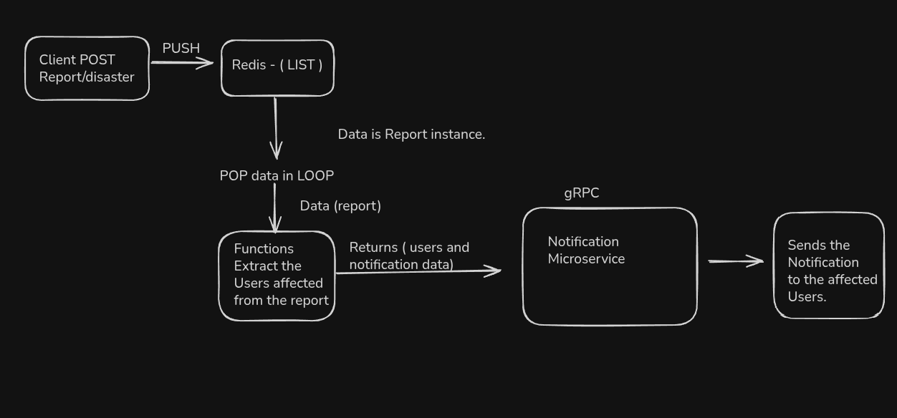

# Disaster Watcher.
- Fully backend api written in golang. Where You can see a nearby or afar(yet to build) disasters happening and react accordingly.

## Motive
- Main motive was to learn how gRPC works
- Also try out this new idea that popped in my head. I was wondering why I rely on whatsapp group notification when people can actually post the disaster they see first or hear about and post them so that the other users who are nearby or afar notify their people. May be thats not my app. Ill think about adding this feature asap.
- I dont trust random person in my local whatsapp group and no clear precaution also need to buid this


## features
- User authorization and authentication
- User input
- User can get nearby report based on thier notification
- Basic crud operations 
- Yeah i need to add some features that should make this somewhat authentic


# API Authentication & Usage Guide

This API uses **JWT Bearer Tokens** for authentication.  
Add this header to all protected requests:

## Step 1 — Register
**POST** `/user/register`

```json
{
  "username": "denzil",
  "password": "mypassword",
  "email": "user@example.com",
  "location": "Mumbai",
  "phoneNumber": "9876543210"
}
```
## Step 2 - Login
**POST** `user/login`
- Returns a JWT token(valid for 24 hours.)

```json
{
  "username": "denzil",
  "email": "myemail@gmail.com",
  "password": "mypassword"
}
```
- Response(jwt token).
```json 
{
  { "token": "eyJhbGciOiJIUzI1NiIs..." }
}
```
## Step 3 - Use the token.
- Include in every protected request.
```
    Authorization: Bearer YOUR_JWT_TOKEN
```

## Step 4 - Access profile(protected).
**GET** `user/profile`
- Response - Returns the current user who is authenticated.
- Example
```json
{
  "user": {
    "id": 1,
    "userName": "denzil",
    "email": "user@example.com",
    "location": "Mumbai",
    "phoneNumber": "9876543210"
  }
}
```
## Step 5 - Reset password 
1. Request reset link And it will give you a token(valid for 15 mins.)
You can find the token in your given email account.
 **GET** `/user/reset-password?email=youremail@/`

2. Reset the password
- Use the token to reset the password
 **POST** `/user/reset-password/`
 -Example request
 ```json
{
  "token": "reset-token",
  "new-password": "newPass123",
  "retype-newpassword": "newPass123"
}
```
## Step 6 - Quick test with Curl.
```bash
# Register
curl -X POST http://localhost:3000/user/register \
  -H "Content-Type: application/json" \
  -d '{"username":"denzil","password":"12345678","email":"user@example.com","location":"Mumbai","phoneNumber":"9876543210"}'

# Login
curl -X POST http://localhost:3000/user/login \
  -H "Content-Type: application/json" \
  -d '{"email":"user@example.com","password":"12345678"}'

# Profile
curl -X GET http://localhost:3000/user/profile \
  -H "Authorization: Bearer YOUR_JWT_TOKEN"

# Request Password Reset
curl -X GET "http://localhost:3000/user/reset-password?email=user@example.com"

# Reset Password
curl -X POST http://localhost:3000/user/reset-password \
  -H "Content-Type: application/json" \
  -d '{"token":"reset-token","new-password":"newPass123","retype-newpassword":"newPass123"}'

```


# System Design

### User posted report and how it communicates with the notification gRPC service.
-- User posts the report
-- The report gets pushed to redis-list ("Report Lists")
-- There is a infinite loop running which simply pops from the redis-list("Report Lists") and gets the report.
-- This report instance is used to get the users affected from helper functions (/Services/helper.go)
-- Then we health check the grpc service and send the notification using this function
SendBatchNotificationsToAffectedUsers(grpc Client, user notification requests, report)

