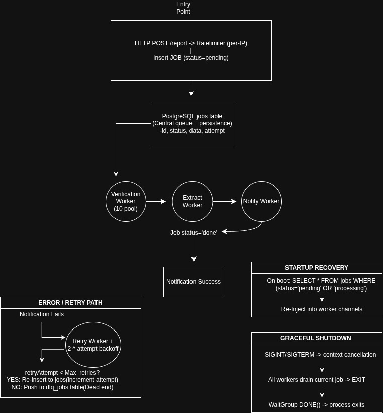

# Disaster-Watcher

A backend system for real-time local disaster reporting and notification. Users post disaster reports or local hazards happening in their area, and nearby users within a 20km radius get notified so they can take precautions, confirm with relatives, or act on the information.

Built in Go, from scratch, without reaching for managed queues or message brokers.

---

## What it does

- Users register, login, and post disaster reports with a location
- The system verifies the report and calculates nearby users using the Haversine formula
- Nearby users are notified via email
- Failed notifications retry automatically with exponential backoff
- Jobs that exhaust all retries are moved to a dead letter queue
- Crashed or interrupted jobs recover automatically on restart

---

## Architecture
## Notification pipeline


### Core systems built from scratch

**Persistent Job Queue** — jobs are stored in PostgreSQL before being pushed to Go channels. On restart, any pending or stuck processing jobs are recovered and requeued automatically. No job is ever lost to a crash.

**Worker Pools** — verification, extract, notification, and retry workers all run as goroutine pools. Each stage passes work to the next via typed Go channels.

**Retry with Exponential Backoff** — failed email notifications retry with increasing wait times (2s → 4s → 8s → 16s...). After max retries, the job moves to a dead letter queue with full error context saved to the database.

**Rate Limiting** — per-IP token bucket rate limiting at the HTTP middleware layer. Separate rate limiter inside the notification worker to control outbound email volume.

**Graceful Shutdown** — `signal.NotifyContext` catches SIGTERM/SIGINT. Workers finish in-flight jobs before exiting. `sync.WaitGroup` ensures main waits for all goroutines to complete before the process exits.

---

## Tech Stack

- **Go** — core language
- **Gin** — HTTP framework
- **PostgreSQL** — primary database and persistent job store
- **GORM** — ORM for standard queries, raw SQL for specific queue operations
- **Docker / Docker Compose** — containerized local development and deployment
- **Railway** — production deployment

---

## API Endpoints

| Method | Endpoint | Description | Auth |
|--------|----------|-------------|------|
| POST | `/api/auth/register` | Register a new user | No |
| POST | `/api/auth/login` | Login and receive JWT | No |
| POST | `/api/reports` | Post a new disaster report | Yes |
| GET | `/api/reports/nearby` | Get reports near your location | Yes |
| GET | `/api/reports/nearby?hours=X` | Get reports from the last X hours | Yes |

---

## Running Locally

### Prerequisites

- Go 1.21+
- Docker and Docker Compose
- PostgreSQL (or use the provided Docker Compose)

### Setup

```bash
git clone https://github.com/icodeologist/disasterwatch
cd disasterwatch/backend
```

Create a `.env` file in the `backend/` directory:

```env
HOST=localhost
DBPORT=5432
DBUSER=your_db_user
PASSWORD=your_db_password
NAME=your_db_name
JWT_SECRET=your_jwt_secret
SMTP_HOST=smtp.gmail.com
SMTP_PORT=587
SMTP_USER=your_email@gmail.com
SMTP_PASSWORD=your_app_password
```

### Run with Docker Compose

```bash
docker-compose up --build
```

### Run without Docker

```bash
go run main.go
```

---

## Job Lifecycle

```
pending → processing → done
                   ↘
                  failed  →  dead letter queue
```

Jobs are inserted as `pending` when a report is created. They move to `processing` when a worker picks them up. On successful notification, they are marked `done`. On exhausted retries, they are marked `failed` and a DLQ record is created with the full error context.

On server restart, jobs in `pending` state and jobs stuck in `processing` for more than 10 minutes are automatically recovered and requeued.

---

## Background

I started this project not knowing what a worker pool was. Concurrency felt unapproachable and the easy path would have been to reach for Kafka or gRPC without understanding why. Instead I built the whole pipeline from first principles — mid coding session, figuring out graceful shutdown, persistent queues, atomic job claiming, exponential backoff, and rate limiting as real problems that needed solving rather than concepts to learn abstractly.

This is the project that made concurrency click.
